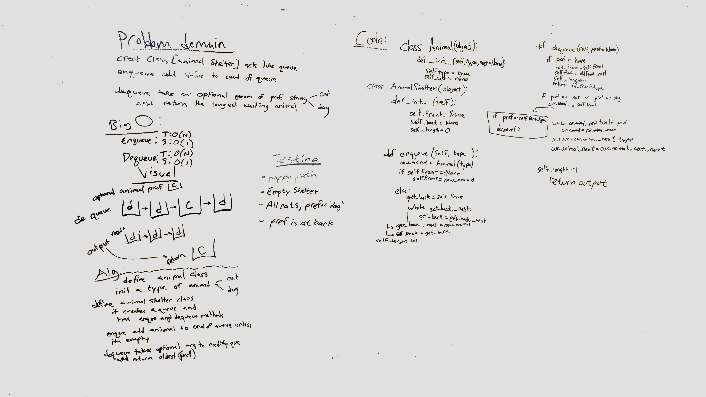
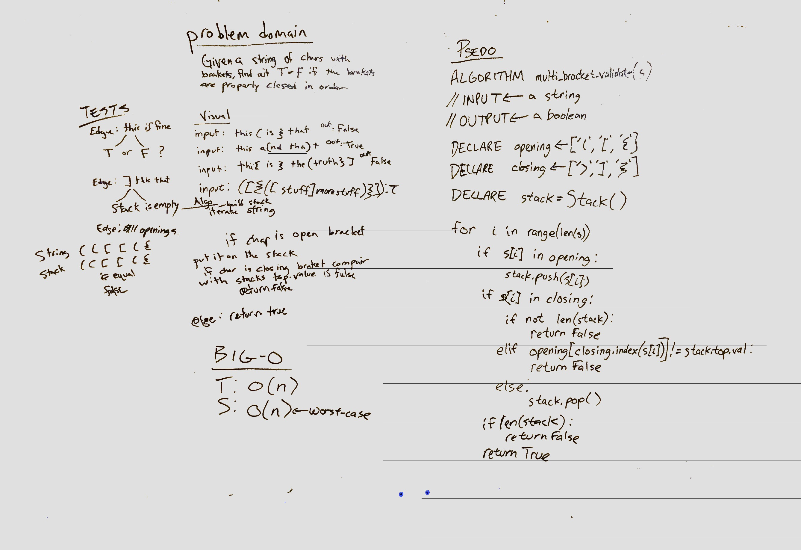

# Insert and shift middle index of array
Code Challenge 02 - Insert and shift an array in middle at index

## Challenge
Add an element to the array without using the built in python methods. Find the middle of the even or odd list accordingly, then while the count is not the middle, add old elements into a new list. Once the middle matches the count, add the new element, change the mid number and go back to adding the old elements to the new list. 

## Solution

# Insert and shift middle index of array
Code Challenge 03 - merger two linked lists

## Challenge
Merge two linked lists so that they add every other element into a new linkedlist so that the new linked listed is merged. 

## Solution

# Create a queue with stacks
Code Challenge 11 - Create a queue with stacks

## Challenge
Using 2 stacks and their methods, push and pop, create a queue that can enqueue and dequeue as normal. 

## Solution

# Create a pet shelter queue
Code Challenge 12 - Create a queue for adopting cats or dogs 

## Challenge
Create a queue that can enqueue as normal and dequeue with a pref for oldest of type (cat or dog) if they are in the queue. 

## Solution

# Validate braket completion
Given a string, check if there brackets are opened and closed in correct order. 

## Challenge
Your function should take a string as its only argument, and should return a boolean representing whether or not the brackets in the string are balanced. There are 3 types of brackets:

Round Brackets : `()`
Square Brackets : `[]`
Curly Brackets : `{}`

## Solution
