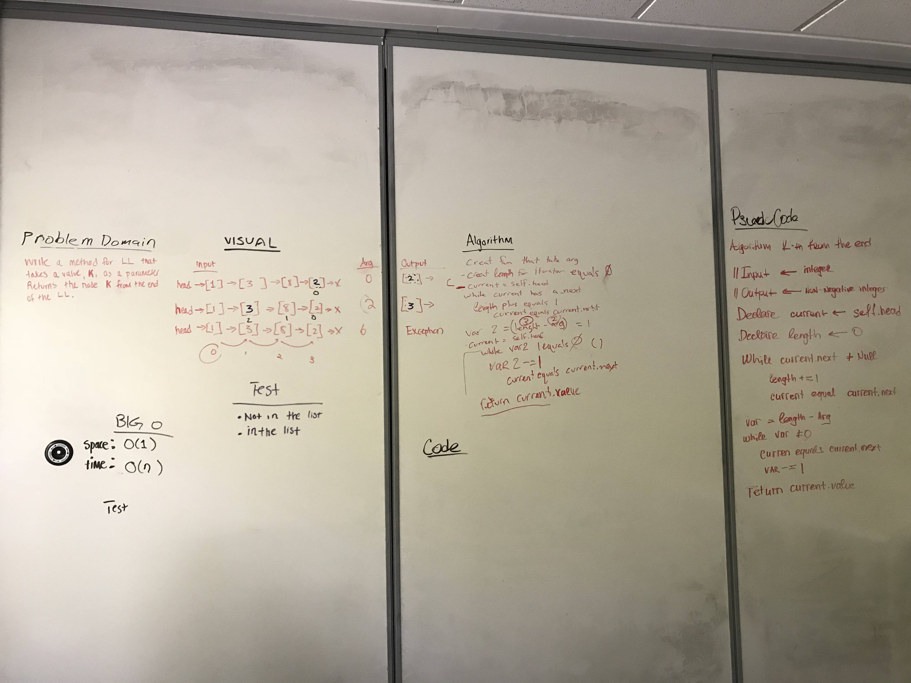

# Insert and shift middle index of array
Code Challenge 07 - Find the kth value from the end of the node. 

## Challenge
receive an index and find the node value from the end that many places for the end of it. 

We while itorate over a ll and set a counter, add one as long as while has next, then reset head to the start. Subtract itorator from the argument. While itorator not 0, and sutract 1 from the itorator and set current next. When itorator equals 0, return the current node.

## Solution
